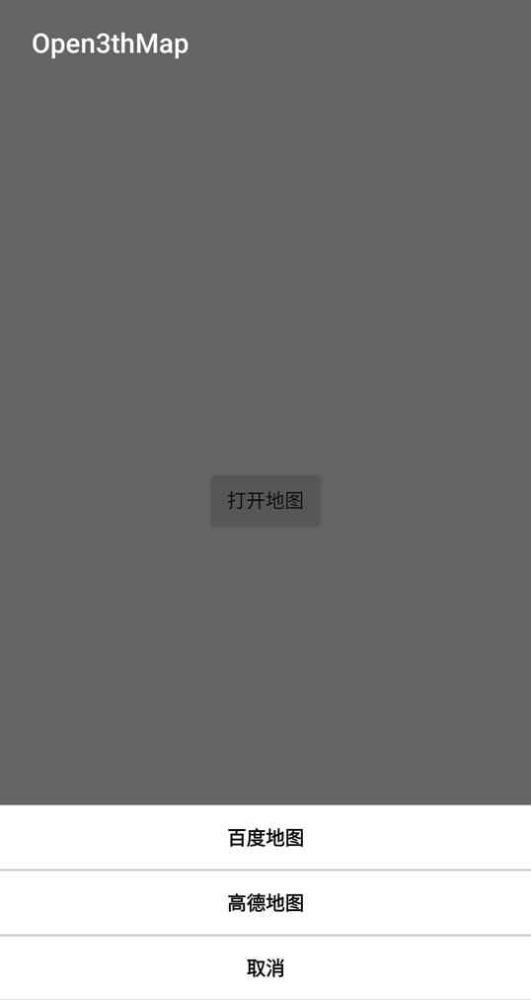
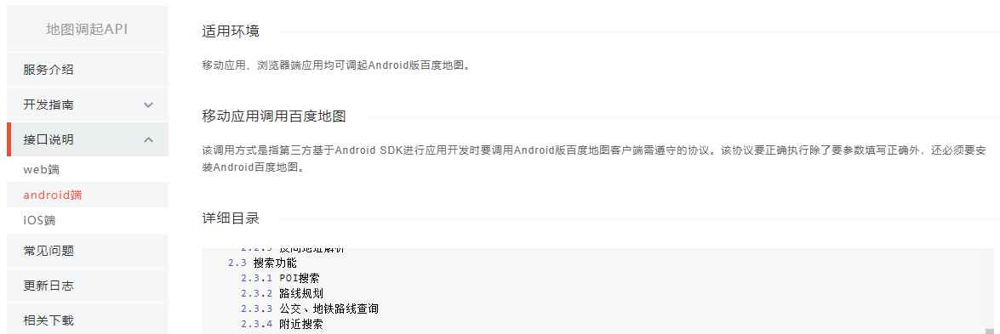
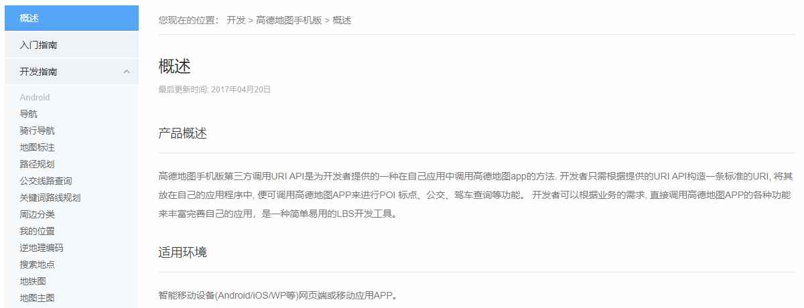

# Open3thMap

安卓手机App调用其他地图App，以实现调用高德地图或百度地图为例

> 注：测试发现需要科学上网才能看到本文档里面的图片

### 效果图

### 参考资料
【1】. http://lbsyun.baidu.com/index.php?title=uri/api/android . 百度地图开放平台/开发文档/服务接口/地图调起API

【2】. https://lbs.amap.com/api/amap-mobile/summary . 高德开放平台/开发支持/高德地图手机版

